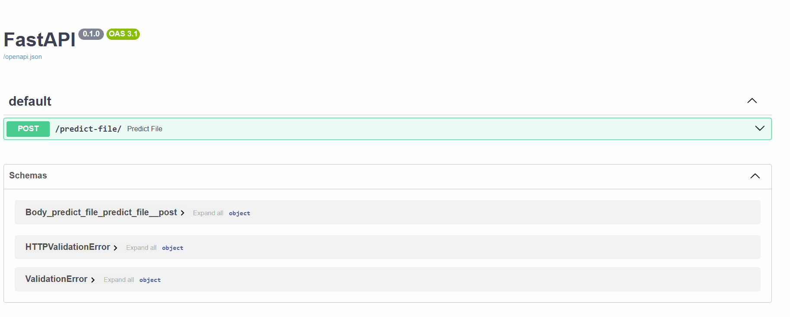

# 🚀 FastAPI ML API on AWS  

## 📌 Overview  
This project is a **FastAPI-based Machine Learning API** for binary classification. It uses **Docker** for containerization and is deployed on **AWS EC2** for scalability.  

## 🏷️ About the Dataset (`coupon.csv`)  

The model is trained on **`coupon.csv`**, a well-known dataset from Kaggle. The goal is to **predict whether a customer will use a discount coupon or not** based on multiple factors such as:  
- Age, gender, income  
- Type of coupon (e.g., restaurant, bar, coffee shop)  
- Context (weekday vs. weekend, time of day)  

This is a **binary classification task**, where the model predicts:  
- `1` → The customer **will use** the coupon  
- `0` → The customer **will not use** the coupon  

The deployed API allows users to send feature inputs and get a **real-time prediction** on whether a coupon will be redeemed.  

---
**Tech Stack:** FastAPI | Docker | AWS EC2  

---

## 🚀 Quick Start  


```
### 1 Clone the Repository  
git clone https://github.com/MMuzykant00/fastapi-ml-aws.git
cd fastapi-ml-aws

### 2 Build and Run Locally

docker build -t fastapi-ml-aws .
docker run -p 8000:8000 fastapi-ml-api

### 3 Deployment on AWS

ssh -i "fastapi-key.pem" ubuntu@51.20.60.81

git pull origin main
docker build -t fastapi-ml-aws .
docker run -d -p 8000:8000 fastapi-ml-api


Live API: http://51.20.60.81:8000/docs


